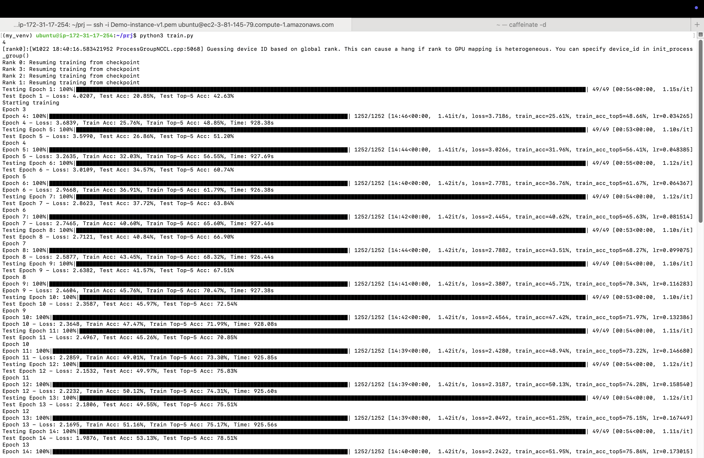
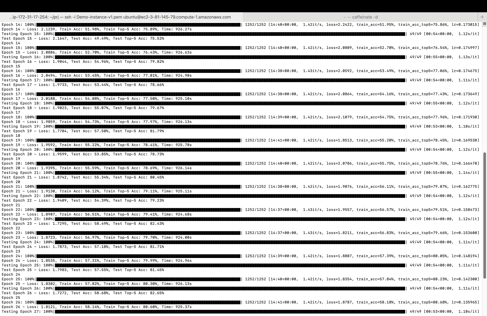
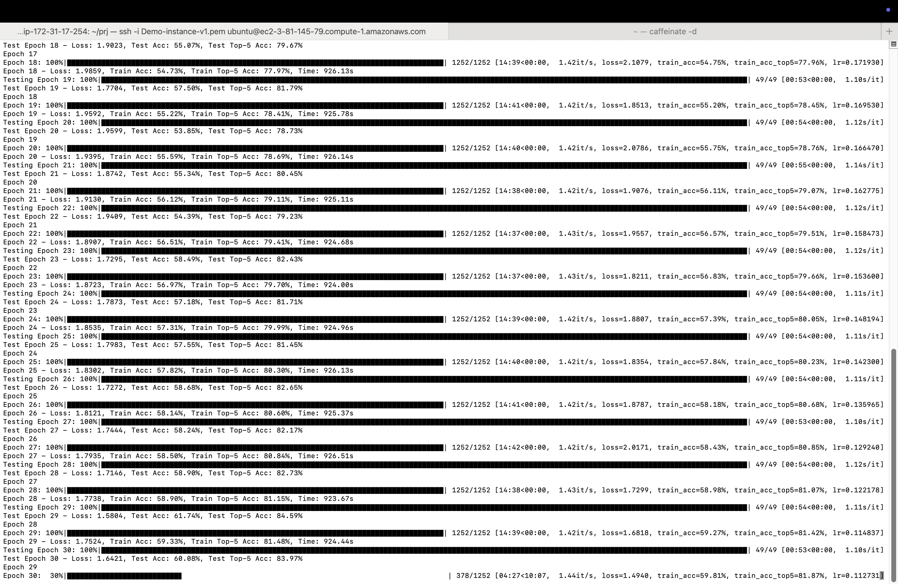
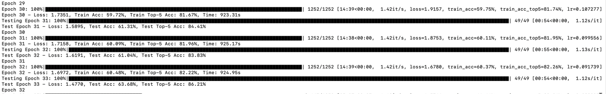
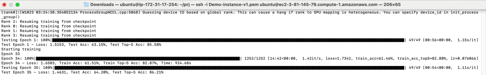
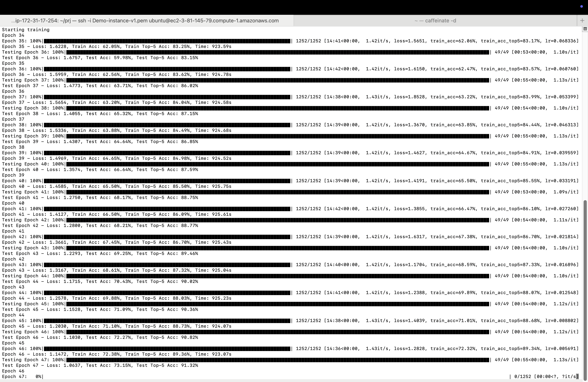
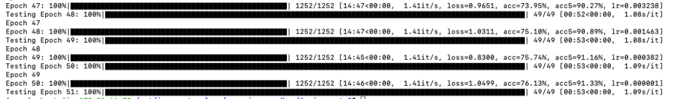

# ImageNet ResNet50

This is a PyTorch implementation of training a ResNet50 model from scratch on the ImageNet-1K dataset.

## About ImageNet

ImageNet is a large dataset of images with over 14 million images and 22,000 categories. For this project, we used ImageNet-1K, a subset containing 1000 categories that has become a standard benchmark in computer vision.

## Training Infrastructure & Process

### AWS Distributed Training

**Setup:**
- Network Volume: 500GB for ImageNet-1K dataset storage
- GPU: 4 NVIDIA L4 GPUs with g512xlarge instance
- Training Time: ~15.5 minutes per epoch (55 epochs total)

**Training Optimizations:**
- Mixed Precision Training (FP16)
- One Cycle Learning Rate Policy
- Distributed Data Parallel (DDP) training
- Gradient Scaling for stable mixed precision training

**Training Configuration:**
```python
class Params:
    def __init__(self):
        self.batch_size = 256
        self.name = "resnet_50_onecycle_distributed"
        self.workers = 12
        self.max_lr = 0.175
        self.momentum = 0.9
        self.weight_decay = 1e-4
        self.epochs = 50
        self.pct_start = 0.3
        self.div_factor = 25.0
        self.final_div_factor = 1e4
```

**Training Monitoring:**
- Used Tensorboard for real-time monitoring of training metrics
- Implemented custom MetricLogger for JSON logging of training and validation metrics

## Model Architecture

ResNet50 consists of 48 Convolutional layers, 1 MaxPool layer, and 1 Average Pool layer, followed by a fully connected layer. The model uses skip connections to solve the vanishing gradient problem.

Key components:
- Input: 224x224x3 images
- Output: 1000 classes (ImageNet-1K)
- Total Parameters: 25.6M

## Training Results

The model was trained for 55 epochs using distributed training across 4 GPUs. Key results:

| Metric | Value |
|--------|-------|
| Final Top-1 Accuracy | 75.89% |
| Final Top-5 Accuracy | 92.53% |
| Final Training Loss | 0.971 |
| Final Validation Loss | 0.971 |
| Total Training Time | ~14.2 hours |
| Average Epoch Time | 925.6 seconds |

### Training Progress

The training showed consistent improvement over time:

- **Early Training (Epochs 1-10):**
  - Started with 28.85% validation accuracy
  - Reached 47.43% validation accuracy by epoch 10
  - Learning rate increased from 0.034 to 0.132
  - Training loss decreased from 3.68 to 2.35

- **Mid Training (Epochs 11-30):**
  - Steady improvement from 49.97% to 61.74% validation accuracy
  - Learning rate peaked at 0.175 and began decreasing
  - Training accuracy improved from 49.01% to 59.72%
  - Top-5 accuracy reached 84.60%

- **Late Training (Epochs 31-55):**
  - Continued improvement from 61.31% to 75.89% validation accuracy
  - Learning rate approached minimum value (~7e-7)
  - Training accuracy improved from 60.10% to 76.62%
  - Top-5 accuracy improved from 84.41% to 92.53%
  - Final epochs showed diminishing returns but still improving

### Detailed Training Metrics

Below is a table showing key metrics at significant points during training:

| Epoch | Train Loss | Train Acc | Train Top-5 | Val Loss | Val Acc | Val Top-5 | Learning Rate |
|-------|------------|-----------|-------------|----------|---------|-----------|---------------|
| 1     | -          | -         | -           | 4.021    | 28.85%  | 42.64%    | -             |
| 10    | 2.346      | 47.48%    | 71.97%      | 2.359    | 47.43%  | 72.00%    | 0.132         |
| 20    | 2.079      | 55.60%    | 78.69%      | 1.874    | 55.35%  | 80.45%    | 0.166         |
| 30    | 1.735      | 59.72%    | 81.67%      | 1.581    | 61.31%  | 84.41%    | 0.107         |
| 40    | 1.458      | 65.50%    | 85.50%      | 1.357    | 66.64%  | 87.59%    | 0.033         |
| 50    | 1.011      | 75.52%    | 90.98%      | 1.009    | 74.56%  | 91.95%    | 7.0e-7        |
| 55    | 0.971      | 76.62%    | 91.59%      | 0.971    | 75.89%  | 92.53%    | 7.0e-7        |

### Training Visualization

Below are screenshots showing the training progress in the terminal:


*Early training epochs showing initial accuracy improvements*


*Middle training epochs showing steady accuracy gains*


*Continued training with increasing validation accuracy*


*Later epochs showing higher accuracy levels*


*Training progress with accuracy exceeding 60%*


*Final training epochs with accuracy approaching 75%*


*Nearing completion of training crossing 75%*

### Learning Rate Schedule

The training utilized a One Cycle Learning Rate policy with the following characteristics:

- Initial learning rate: 0.007 (= max_lr/div_factor = 0.175/25.0)
- Maximum learning rate: 0.175 (reached around epoch 15-17)
- Final learning rate: ~7.0e-7 (= max_lr/final_div_factor = 0.175/1e4)
- Warm-up phase: First 30% of training (approximately 15 epochs)
- Annealing phase: Remaining 70% of training

This learning rate schedule was crucial for achieving stable training and high accuracy. The warm-up phase helped prevent divergence early in training, while the annealing phase allowed for fine-tuning of the model weights.

## Distributed Training Implementation

The training implementation uses PyTorch's DistributedDataParallel (DDP) for efficient multi-GPU training:

- Process group initialization with NCCL backend
- Distributed samplers for both training and validation datasets
- Gradient synchronization across all GPUs
- Metrics aggregation using all_reduce operations
- Checkpointing for resuming training

## Data Logging and Monitoring

All training metrics were logged using:

1. **TensorBoard**: For real-time visualization during training
2. **Custom JSON Logger**: Detailed metrics stored in `final_log_v2.json`
3. **Terminal Output**: Progress displayed in the terminal as shown in the screenshots

The logs capture the complete training journey, including:
- Per-epoch metrics for both training and validation
- Learning rate adjustments
- Training time per epoch

## Future Work

1. Experiment with different learning rate schedules
2. Implement more advanced data augmentation techniques
3. Try different model architectures (ResNet101, EfficientNet)
4. Explore knowledge distillation to create smaller, efficient models
5. Implement quantization for inference optimization